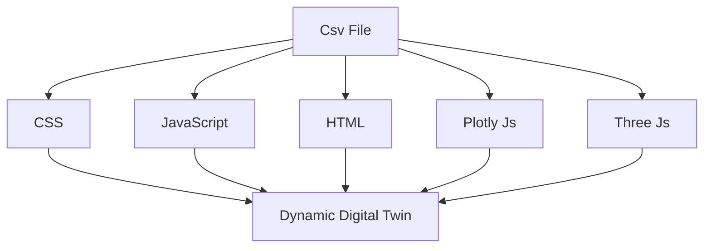

# Dynamic Web For Digital Twin

This is a simple web application where users can create dynamic websites based on values stored in a CSV file. Each time the code is run, a new static website is generated using the updated data from the CSV file. Users can add new data to the CSV file, and the corresponding static web pages will be generated accordingly.

## Features

- **Dynamic Content Generation**: Data stored in the CSV file is used to dynamically generate static web pages.
- **User-Friendly**: Users can easily add new data in the CSV file without needing to modify HTML or code manually.
- **Automated Static Website Creation**: Every time the code is executed, new web pages are created based on the latest data in the CSV file.

## How It Works

1. **CSV File**: The data that powers the website is stored in a CSV file (`data.csv`). This CSV file contains various fields such as page title, content, and links.
2. **Dynamic Page Creation**: When the script runs, it reads the CSV file and generates new static HTML pages based on the contents of the file.

3. **Easy Updates**: To update the website content, simply add or modify rows in the CSV file. The next time the script is executed, the website will automatically reflect the new content.

## How to Use

### Prerequisites

Make sure you have the following installed:

- Python (or any scripting language you are using)
- Basic web server (if you want to test locally)

### Steps to use this Project

1. Clone the repository:

   ```bash
   git clone <repository_url>
   cd dynamic-web
   ```

2. Edit The csv fiel based on your Requirement
   > 1. M and N Define the number of rows and columns you want to create on the webpage.
   > 2. Define the no of element and then define the row and coulmn respectevly (Assume as matrix).
   > 3. Now define the chart type, chart title , xAxis, yAxis and the fetching the dat abased on interval and following the data URl.
   > 4. User can add the 3d model also for dispalying the Digital Twin.

### Author

Vishal Kumar Upadhyay

## Languages

1.  HTML
2.  CSS
3.  JavaScript

## Library

1.  Three JS Library
2.  Plotly Js

### Flow Chart


